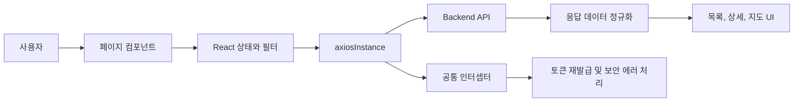

# Nyangmong Frontend

냥몽은 유기동물의 입양 기회를 넓히고 반려동물과 함께 이용할 수 있는 행사와 시설 정보를 제공하는 비영리 정보 공유 서비스입니다. 이 저장소는 냥몽 서비스의 프론트엔드 애플리케이션을 담당하며, 사용자가 유기동물 정보, 반려동물 행사, 반려동물 관련 시설을 빠르게 탐색할 수 있도록 구성되어 있습니다.

## 주요 기능

### 유기동물 정보

- 지역과 축종 필터를 기반으로 유기동물 목록을 조회합니다.
- 서버의 페이지네이션 응답을 사용해 목록을 페이지 단위로 탐색합니다.
- 유기번호를 기준으로 상세 페이지에 진입해 품종, 나이, 성별, 발견 장소, 보호소 연락처, 특이사항 등을 확인합니다.
- 이미지가 없거나 로드에 실패한 경우 기본 로고 이미지를 표시합니다.

### 반려동물 행사 정보

- 반려동물 관련 행사 목록을 페이지 단위로 조회합니다.
- 행사 상세 페이지에서 장소, 행사일, 운영 시간, 요금, 예약일, 주소, 이미지, 홈페이지 링크를 확인합니다.
- 홈페이지 URL이 있는 경우 새 탭으로 외부 페이지를 열 수 있습니다.

### 반려동물 관련 시설 지도

- 카카오맵을 기반으로 반려동물 문화시설, 동물병원, 미용실, 카페, 용품점, 박물관, 미술관, 문예시설, 약국 정보를 확인합니다.
- 카테고리별로 필요한 지역, 세부 카테고리, 시군구 조건을 선택할 수 있습니다.
- 좌측 목록과 우측 지도를 함께 배치해 목록 선택과 지도 위치 확인 흐름을 연결했습니다.
- 마커 클릭 시 상세 모달을 열어 주소, 전화번호, 운영 정보, 반려동물 동반 조건 등을 확인합니다.

### 공통 API 처리

- `axiosInstance`를 통해 모든 API 요청을 공통 설정으로 처리합니다.
- 요청 인터셉터에서 `Authorization` 토큰과 `X-Fingerprint` 헤더를 자동으로 첨부합니다.
- 응답 인터셉터에서 토큰 만료, fingerprint 누락, 요청 제한, 비정상 접근 에러를 공통 처리합니다.
- 로컬, 사설망, 운영 도메인에 따라 백엔드 호스트를 자동 선택합니다.

## Tech Stack

| 영역             | 기술                                                           |
| ---------------- | -------------------------------------------------------------- |
| UI               | React 19                                                       |
| Build Tool       | Vite 7                                                         |
| Routing          | React Router DOM 7                                             |
| HTTP Client      | Axios                                                          |
| Map              | Kakao Maps JavaScript SDK                                      |
| State            | React Hooks, Context API                                       |
| Security Utility | Web Crypto API, localStorage 기반 fingerprint                  |
| Analytics        | Firebase Analytics 설정 파일                                   |
| Lint             | ESLint                                                         |
| Styling          | CSS Modules 방식은 아니지만 페이지/컴포넌트 단위 CSS 파일 분리 |

## 기술 선택 이유

### React

유기동물 목록, 행사 목록, 지도 필터처럼 사용자 입력에 따라 화면 상태가 자주 바뀌는 서비스이기 때문에 컴포넌트 기반 UI를 구성할 수 있는 React를 사용했습니다. 목록, 상세, 지도, 공통 레이아웃을 독립적인 컴포넌트로 나누기 쉬워 기능 확장에도 유리합니다.

### Vite

개발 서버 구동과 HMR이 빠르기 때문에 화면을 자주 수정하는 프론트엔드 개발에 적합합니다. 설정이 단순하고 React 프로젝트를 가볍게 시작할 수 있어 팀 프로젝트나 MVP 단계에서 생산성이 좋습니다.

### React Router

유기동물 목록/상세, 행사 목록/상세, 지도 페이지처럼 명확히 분리된 화면이 있어 클라이언트 라우팅이 필요했습니다. URL 기반으로 페이지를 구분하면 사용자가 특정 상세 화면을 직접 공유하거나 새로고침해도 자연스럽게 접근할 수 있습니다.

### Axios

이 프로젝트는 백엔드 API와의 통신이 많고, 토큰과 fingerprint 헤더를 모든 요청에 공통으로 실어야 합니다. Axios 인터셉터를 사용하면 요청 전 헤더 주입, 응답 후 토큰 재발급, 에러 처리를 한 곳에서 관리할 수 있어 각 페이지 컴포넌트의 중복 코드를 줄일 수 있습니다.

### Kakao Maps SDK

시설 정보는 주소와 위치가 핵심인 기능입니다. 카카오맵 SDK를 사용해 주소 기반 좌표 변환과 지도 마커 표시를 구현했으며, 목록에서 선택한 시설을 지도 중심으로 보여주는 방식으로 탐색 경험을 강화했습니다.

### Web Crypto API

로그인 또는 관리자 관련 정보를 브라우저 저장소에 보관할 때 평문 저장을 피하기 위해 AES-GCM 기반 암복호화 유틸을 준비했습니다. 또한 로그인 없는 서비스에서도 요청자를 구분할 수 있도록 브라우저 환경 정보를 SHA-256으로 해시한 fingerprint를 생성해 사용합니다.

## 프로젝트 구조

```text
stray_front/
├── package.json
├── README.md
└── stary-front/
    ├── configs/
    │   ├── axios-config.js        # Axios 인스턴스, 인터셉터, 토큰 재발급 처리
    │   ├── host-config.js         # 실행 환경별 백엔드 URL 및 API prefix 관리
    │   ├── HandleAxiosError.js    # 공통 Axios 에러 처리 유틸
    │   └── firebase-config.js     # Firebase Analytics 설정
    ├── public/
    │   ├── logo.png
    │   └── nukki.png
    └── src/
        ├── App.jsx                # 전체 라우팅과 공통 레이아웃
        ├── components/
        │   ├── Header.jsx         # 상단 네비게이션
        │   ├── Footer.jsx         # 서비스 소개 푸터
        │   └── MapComponent.jsx   # 카카오맵 로딩, 마커, 좌표 변환
        ├── context/
        │   ├── UserContext.jsx    # 사용자 인증 상태 관리
        │   └── AdminContext.jsx   # 관리자 인증 상태 관리
        ├── hooks/
        │   ├── useFingerprint..tsx
        │   ├── use-encode.jsx
        │   └── user-log-hook.jsx
        └── pages/
            ├── StrayAnimalList.jsx
            ├── StrayAnimalDetail.jsx
            ├── FestivalList.jsx
            ├── FestivalDetail.jsx
            └── FacilityMapPage.jsx
```

## 라우팅 구조

| Path                   | Page                | 설명                                        |
| ---------------------- | ------------------- | ------------------------------------------- |
| `/`                    | `Navigate`          | `/stray/list`로 리다이렉트                  |
| `/stray/list`          | `StrayAnimalList`   | 유기동물 목록, 지역/축종 필터, 페이지네이션 |
| `/stray/detail/:id`    | `StrayAnimalDetail` | 유기동물 상세 정보                          |
| `/festival/list`       | `FestivalList`      | 반려동물 행사 목록                          |
| `/festival/detail/:id` | `FestivalDetail`    | 행사 상세 정보                              |
| `/map`                 | `FacilityMapPage`   | 반려동물 관련 시설 지도                     |

## 설계 흐름



이 프로젝트는 화면 단위 페이지 컴포넌트가 데이터를 요청하고, 공통 API 설정은 `configs`에 모아 관리하는 방식으로 설계되어 있습니다. 화면에서 필요한 상태는 각 페이지에서 직접 관리하고, 지도처럼 재사용되거나 복잡도가 높은 기능은 별도 컴포넌트로 분리했습니다.

## API Prefix

`stary-front/configs/host-config.js`에서 백엔드 주소와 서비스별 prefix를 관리합니다.

| 상수       | 경로                       | 용도                             |
| ---------- | -------------------------- | -------------------------------- |
| `PET`      | `/pet-service/pet`         | 유기동물 목록/상세 API           |
| `TOKEN`    | `/pet-service/token/issue` | 토큰 재발급 API                  |
| `MAP`      | `/map-service/map`         | 문화시설 지도 API                |
| `HOSPITAL` | `/map-service/hospital`    | 동물병원 API                     |
| `STYLE`    | `/map-service/culture`     | 미용실, 카페, 용품점 등 시설 API |
| `FESTIVAL` | `/map-service/festival`    | 행사 정보 API                    |
